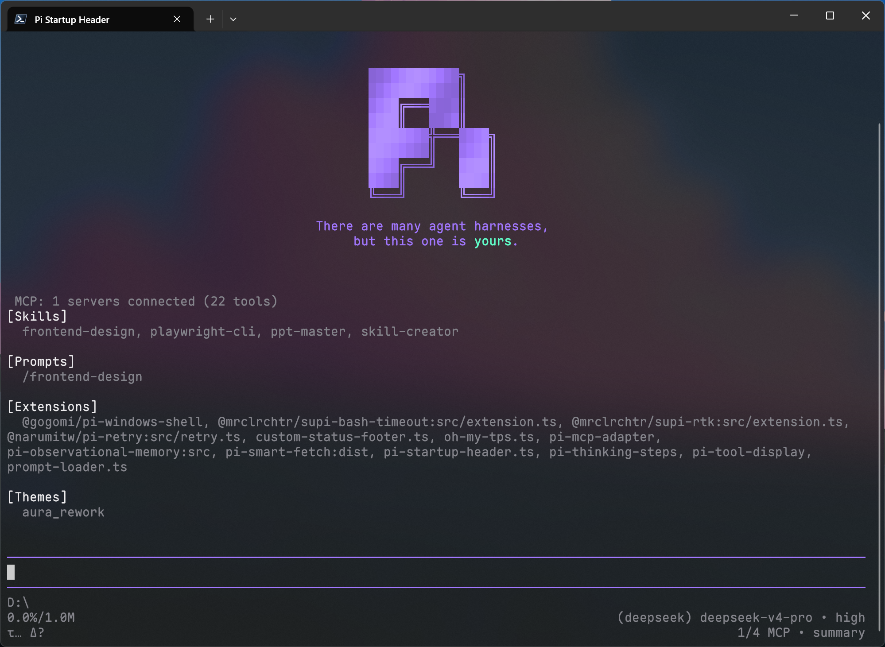

# Pi Startup Header

[English](README.md) | 简体中文

每次打开 Pi TUI，迎接你的总是那段平平无奇的浅色文本：

```
pi v0.xx.x
escape interrupt · ctrl+c/ctrl+d clear/exit · / commands · ! bash · ctrl+o more
Press ctrl+o to show full startup help and loaded resources.

Pi can explain its own features and look up its docs. Ask it how to use or extend Pi.
```

它契合 Pi 在设计上独有的克制，却让人略感无聊。终于有一天，你彻底厌倦了。

## 概要

`pi-startup-header` 用一个跟随主题的渐变 ASCII Header 替换 Pi 默认启动头部。

## 安装

### npm package

```bash
pi install npm:pi-startup-header
```

### Git repository

```bash
pi install git:github.com/EnderLiquid/pi-startup-header
```

## 功能

优秀的 AI 编码终端，理应搭配优雅的启动页头部——`pi-startup-header` 正是为此而生。

既然 [Pi 的官网主页](https://pi.dev/) 设计让人印象深刻，我们为什么不把它搬进终端呢？

`pi-startup-header` 只做一件事：把会话开始时默认的顶部 header 替换成 Pi 风格的渐变 ASCII Logo 和官网标语。Logo 和标语的取色完全基于当前主题，无需额外配置，就能得到协调的视觉效果。

从启动 Pi 的那一刻起，界面就会有一点不一样。

## 预览

一张图胜过千言万语：



## 许可证

MIT License
